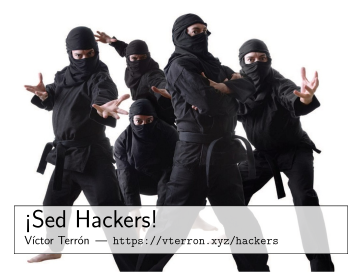

The slides, in Spanish, of my talk to first-year Computer Science students.

[][pdf]

They are also [available as a PDF][pdf], always up-to-date via [a GitHub action](.github/workflows/latex.yml).

-   Title: *Be Hackers!*
-   Language: Spanish
-   License: [CC BY-SA 4.0](http://creativecommons.org/licenses/by-sa/4.0/)

More information is available on the [GitHub page of the talk](http://vterron.github.io/sed-hackers/).

[pdf]: http://static.vterron.xyz/sed-hackers.pdf
