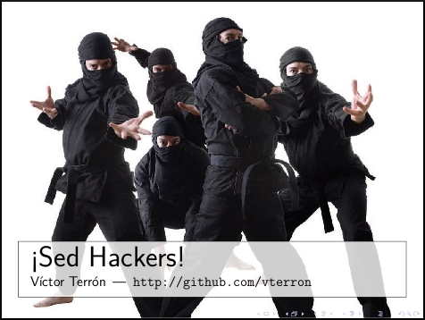

The slides, in Spanish, of the talk I gave to first-year Computer Science students at the `ETSIIT <http://etsiit.ugr.es/>`_ (Granada, Spain) in May 2013, March 2014 and June 2015.

|PDF|_

They are also `available as a PDF`__, always up-to-date (via git hooks).

* Title: *Be Hackers!*
* Language: Spanish
* License: `CC BY-SA 4.0 <http://creativecommons.org/licenses/by-sa/4.0/>`_

.. _PDF: http://www.iaa.es/~vterron/sed-hackers.pdf
__ PDF_
